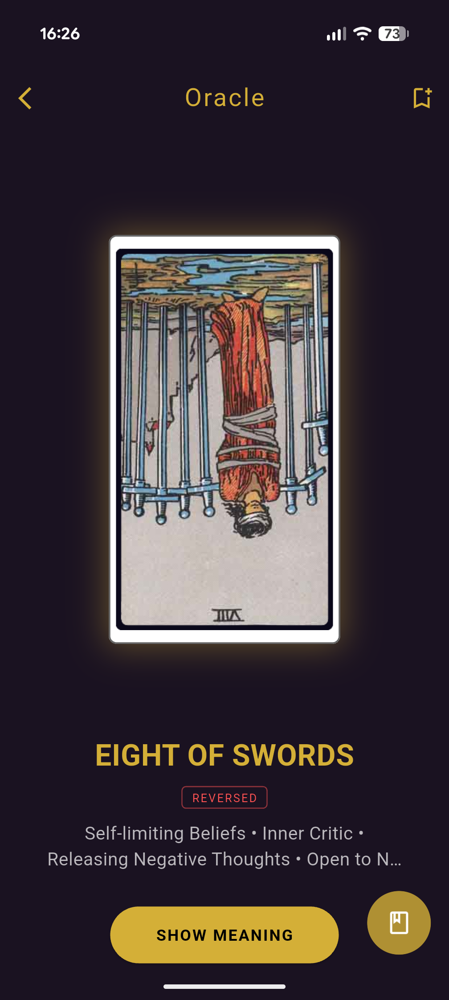
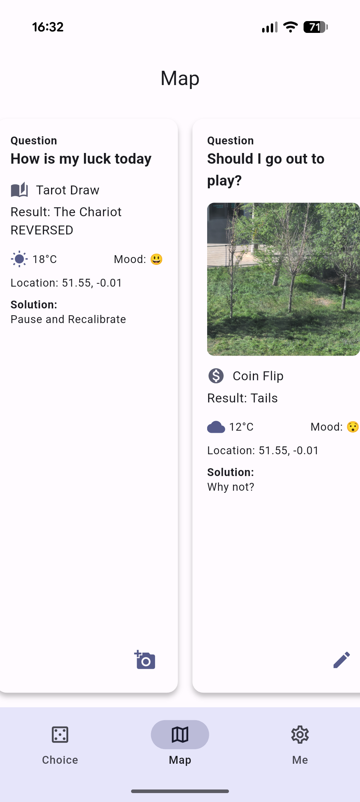
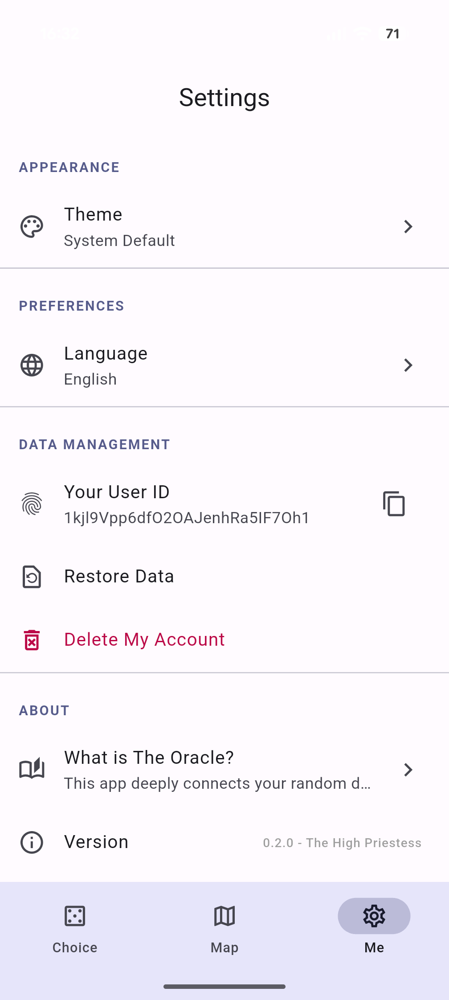

<p align="center">
  
</p>

<h1 align="center">Oracle Map</h1>

<p align="center">
  A small mobile app for everyday decisions.
</p>

<p align="center">
  <a href="showcase/media/Test.mp4">Demo Video</a> ·
  <a href="https://cinmou.github.io/casa0015-oracle-map/showcase/web/">Landing Page</a> ·
  <a href="showcase/screenshots/">Screenshots</a>
</p>

## Overview

Oracle Map helps users deal with small daily choices without turning them into a large task. It is not an AI assistant that gives a direct answer. It is a quiet support tool that helps users pause, act, and reflect.

Modern life has many small choices: what to eat, whether to go out, whether to rest, or how to spend an evening. These choices look small, but they can take time and mental energy.

Oracle Map gives users simple physical tools for these moments. The app does not force a final answer. It helps users notice their own reaction to the result, then lets them record the moment if they want to.

## Problem We Solve

Oracle Map is designed for small daily decisions that slowly take time and mental energy away from users.

Examples include:

- what to eat for breakfast
- whether to go out after work
- whether to rest or watch a film
- whether to meet friends or stay with family

These are not large life decisions, but they still shape daily life. Many people do not need a system that gives them a direct answer. They need a calm tool that helps them stop for a moment, make a choice, and better understand how they feel about it.

Oracle Map solves this by combining simple physical interactions, subjective decision tools, and optional reflection records.

## Persona

### Primary User: Mina, 27, Busy Urban Professional

Mina makes many small decisions every day. None of them are serious on their own, but together they create decision fatigue. She does not want a heavy planning app, and she does not want an AI assistant to tell her what to do.

What she wants is something quick, light, and personal:

- a tool that helps her break indecision
- a simple physical action that feels more real than pressing a plain button
- a private way to record her mood and final choice
- a way to look back and notice patterns in her own behaviour

Oracle Map is designed for users like Mina. It supports reflection without becoming intrusive.

## Design Idea

The app is non-intrusive. It does not tell the user what they must do, and it does not ask the user to record everything.

The decision tools are familiar, subjective, and personal:

- Coin flip
- Tarot card draw
- Dice roll
- Fortune stick draw

These tools are not meant to be rational decision engines. Their value comes from the user's response: agreement, doubt, relief, or resistance. This helps the user explore what they may already want.

When a user saves a choice, they can record the question, mood, final decision, and the result given by the app. Later, the Decision Map lets them look back at these moments and see patterns in their daily choices.

## Screenshots

| Choice Tools | Dice Roll | Fortune Sticks |
| --- | --- | --- |
|  |  |  |

| Oracle | Decision Map | Settings |
| --- | --- | --- |
|  |  |  |

## Demo

The demo video is stored in the repository:

[Watch the demo video](showcase/media/Test.mp4)

## Main Features

- Four decision tools for small daily choices
- Physical interaction through tap and shake gestures
- Animated results instead of instant button answers
- Optional decision saving
- A Decision Map that records past choices
- Mood, question, final decision, and tool result for each saved record
- Weather and location context for saved records
- Anonymous cloud account with Firebase
- Optional photo support through the camera or gallery

## Connected Environment

The app connects personal decisions with the user's physical context.

It uses:

- Device motion sensors for shake-based actions
- Location data for context
- OpenWeatherMap API for current weather
- Firebase Auth for anonymous login
- Firestore for cloud records
- Camera and gallery access for optional images

This makes each saved decision a record of a real moment, not only a random result.

## User Flow

1. Open the app and read the intro screen.
2. Choose a tool: coin, tarot, dice, or fortune stick.
3. Use touch or shake interaction.
4. See an animated result.
5. Optionally save the decision.
6. Add a question, mood, and final decision.
7. Review saved choices in the Decision Map.

## Testing

The app was installed and tested on real phones:

- Google Pixel 9 Pro XL
- iPhone 15 Pro

The main flows were checked:

- App launch
- Coin flip
- Dice roll
- Tarot draw
- Fortune stick draw
- Shake interaction
- Saving a decision
- Decision Map display
- Location and weather context
- Camera or gallery image support

## Setup

Install dependencies:

```bash
flutter pub get
```

Create a local `.env` file for the weather API key. This file is not committed.

Run the app:

```bash
flutter run
```

## Notes

The app uses Firebase and OpenWeatherMap. A valid Firebase setup and local API key are needed for the full cloud and weather features.

## Future Work

- Add more review tools for the Decision Map
- Improve offline behaviour
- Add more user testing
- Make the landing page more visual
